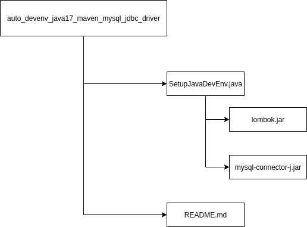

# Auto Java Development Environment Setup  

Script installer otomatis berbasis Java untuk mempersiapkan environment pengembangan Java, lengkap dengan:  
- **Java 17 (JDK)**  
- **Apache Maven**  
- **Lombok**  
- **MySQL Server & Client**  
- **MySQL JDBC Driver**  

---

## Fitur
- Instalasi **Java 17** untuk kebutuhan pengembangan modern.  
- Setup **Apache Maven** untuk manajemen proyek dan dependency.  
- Download otomatis **Lombok** agar coding lebih ringkas.  
- Instalasi **MySQL** (server & client) untuk kebutuhan database.  
- Download **MySQL JDBC Driver** untuk koneksi Java ke MySQL.  
- Memastikan setiap paket hanya diinstal jika belum tersedia.  

---

## Struktur Project



---

## ⚙️ Cara Menjalankan

1. Clone repository ini:
   ```bash
   git clone https://github.com/arifnrrmdn/java-dev-env-setup.git
   cd java-dev-env-setup```
2. Compile prgram java 
    ```bash
    javac SetupJavaDevEnv.java 
    ```

3. Jalankan Program
    ```bash
    java SetupJavaDevEnv
    ```


## Hasil Instalasi
    java -version              # Mengecek versi Java
    mvn -v                     # Mengecek versi Maven
    java -jar lombok.jar       # Integrasi Lombok ke IDE
    mysql --version            # Mengecek versi MySQL
    ls mysql-connector-j.jar   # Pastikan JDBC driver sudah ada


## ✍️ Author

- **Nama**     : Arif N Ramadhan  
- **GitHub**   : [arifnrrmdn](https://github.com/arifnrrmdn)  
- **Tanggal**  : 2 Agustus 2025  
- **Lisensi**  : Bebas digunakan dan dimodifikasi (Open Attribution)  
